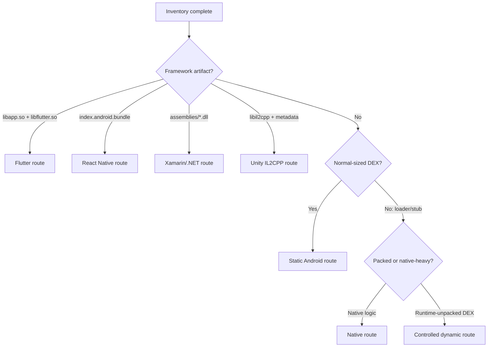

# Triage an Android package

Triage answers three questions before expensive work begins: **what container is this, where is the behavior, and what may interfere with inspection?**

## 1. Preserve and identify the target

Record the source, filename, size, and cryptographic hash. Work on a copy.

```bash
file sample.apk
sha256sum sample.apk
unzip -t sample.apk
```

Do not trust the extension. APK, XAPK, APKS, and APKM files are ZIP-based, while an AAB is a publishing bundle rather than a directly installable package.

## 2. Classify the container

| Format | Typical contents | First action |
|---|---|---|
| `.apk` | One installable package | Inventory directly |
| `.aab` | Bundle modules and configuration | Use `bundletool` to produce an APK set |
| `.apks` | APK set generated by `bundletool` | Unzip; identify `base*.apk` and target splits |
| `.xapk` / `.apkm` | Vendor bundle of base and split APKs | Unzip; inspect metadata and base APK |
| Split APK directory | Base plus ABI/density/language splits | Keep relevant splits with the base |

```bash
unzip -l sample.apk | sed -n '1,120p'
```

Look for:

- `classes.dex`, `classes2.dex`, … — DEX count and scale;
- `lib/<abi>/*.so` — native code and supported architectures;
- `assets/` — framework bundles, models, configuration, encrypted payloads;
- `res/` and `resources.arsc` — Android resources;
- `META-INF/` and signing blocks — packaging/signature context.

## 3. Read package metadata

Decode or inspect the manifest:

```bash
apkanalyzer manifest print sample.apk > manifest.xml
# or
apktool d -f sample.apk -o output/apktool
```

Capture:

- package ID, version name, and version code;
- `minSdkVersion` and `targetSdkVersion`;
- custom `Application` class;
- launch activity;
- permissions;
- exported activities, services, receivers, and providers;
- network security configuration and backup/debuggable flags.

:::caution Exported does not automatically mean vulnerable
Manifest exposure is a lead. Confirm permission gates, intent validation, caller checks, and reachable behavior before reporting a security issue.
:::

## 4. Fingerprint compiler and protection

```bash
apkid sample.apk
```

Treat fingerprints as signals, not verdicts. Corroborate with file structure and code:

- Kotlin metadata and coroutine classes suggest Kotlin;
- short identifiers and aggressive inlining suggest R8/ProGuard;
- encrypted constants and reflection may indicate commercial obfuscation;
- a tiny loader DEX plus large native libraries may indicate a packer;
- known framework artifacts can make DEX secondary.

## 5. Locate the implementation layer



### High-value framework clues

| Artifact | Route |
|---|---|
| `lib/*/libapp.so`, `libflutter.so`, `assets/flutter_assets/` | Flutter |
| `assets/index.android.bundle`, Hermes magic/header, `libhermes.so` | React Native/Hermes |
| `assemblies/*.dll`, Mono runtime libraries | Xamarin/.NET |
| `assets/bin/Data/Managed/*.dll` | Unity Mono |
| `libil2cpp.so` and `global-metadata.dat` | Unity IL2CPP |
| large application-specific `.so` with JNI bridge methods | Native/JNI |

See [Managed framework payloads](./managed-frameworks.md) for branch-specific tools.

## 6. Choose primary and verification tools

For conventional Android, use two views with different strengths:

```bash
apktool d sample.apk -o output/apktool
jadx -d output/jadx sample.apk
```

- `apktool` gives resources, a decoded manifest, and smali close to DEX semantics.
- `jadx` gives readable Java/Kotlin-like output for navigation and search.

Add APKiD's report and raw archive inventory. If critical logic is confusing, use smali and a second decompiler before reaching a conclusion.

## 7. Define the next question

Triage is complete when you can write:

```text
Target:       package/version/hash
Container:    APK, bundle, or split set
Main layer:   DEX, native, JavaScript, managed assembly, or mixed
Protection:   none, optimizer, obfuscator, packer, unknown
Primary tool: selected tool and why
Verifier:     independent representation or runtime observation
Goal:         bounded behavior to investigate next
```

Do not decompile every artifact merely because it exists. Follow the shortest route to the authorized question.
