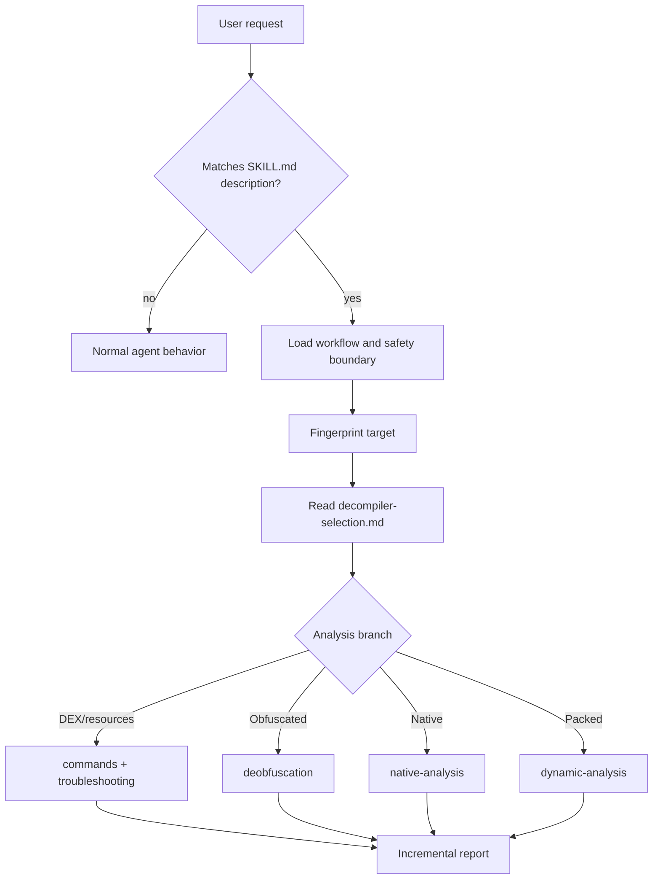

# How the skill works

The codebase is intentionally small. `SKILL.md` supplies the trigger and default operating procedure; files under `references/` supply deeper guidance only when a branch needs it.

## Runtime architecture



This is **progressive disclosure**: the core instructions stay short, while specialist details are loaded when evidence justifies them.

## The `SKILL.md` contract

The YAML front matter has two fields:

- `name` is the stable skill identifier.
- `description` is the discovery surface. It names user intents, package formats, major tools, and a mandatory selection-matrix lookup.

The Markdown body establishes:

- the legitimate-use boundary;
- an eight-stage workflow;
- a quick tool cheat sheet;
- links to detailed references.

Changing the description changes when a host agent is likely to load the skill. Changing the body changes what it does after loading. See [Authoring the skill](./contributing/skill-authoring.md) before editing either.

## Why tool selection is mandatory

The skill explicitly requires `references/decompiler-selection.md` before recommending a tool because “Android app” does not imply “DEX contains the application.” Examples:

| Evidence | Likely implication | Better first move |
|---|---|---|
| `libapp.so` and `libflutter.so` | Flutter/AOT Dart | Inspect snapshot-aware Flutter artifacts |
| `assets/index.android.bundle` | React Native | Extract the JS or Hermes bundle |
| `assemblies/*.dll` | Xamarin/.NET | Use a .NET decompiler |
| `libil2cpp.so` + `global-metadata.dat` | Unity IL2CPP | Pair metadata extraction with native analysis |
| tiny `classes.dex` + loader libraries | packer/virtualizer | Confirm protection; consider controlled runtime dumping |
| normal multidex + R8 names | conventional Android | `apktool` + `jadx`, with smali cross-checks |

A named tool is the result of triage, not the start of it.

## Reporting model

The workflow asks for incremental reports rather than one giant source dump. A useful report separates:

1. **Observed facts** — files, hashes, manifest values, exports, strings, tool output.
2. **Interpretation** — likely framework, protection, component purpose, control flow.
3. **Confidence** — direct, strongly inferred, or speculative.
4. **Next action** — the smallest step that resolves the open question.

For example:

```text
Observed: classes.dex is 19 KiB; lib/arm64-v8a/libloader.so is 2.8 MiB.
Interpretation: DEX is probably a loader stub and useful code may be unpacked at runtime.
Confidence: strong, pending APKiD and class-loader inspection.
Next: inspect Application.attachBaseContext and JNI_OnLoad before preparing a device.
```

This makes it possible to stop early when the user's question is answered.

## What is not automated

The repository does not include executables, wrapper scripts for third-party tools, target uploads, or a one-command pipeline. That is deliberate:

- tool versions and licenses vary;
- dynamic work requires device-specific setup and explicit authorization;
- a fixed pipeline can silently analyze the wrong layer;
- agents should show why a tool was selected.

The [command reference](./reference/commands.md) provides reproducible building blocks without hiding those decisions.
