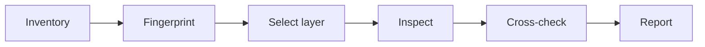

# Analyze the package that is actually there

APKDecomp is an **agent skill**, not another decompiler. It teaches a coding agent how to inspect an Android package, identify where its behavior lives, choose an appropriate toolchain, and verify uncertain output.

The default path is deliberately simple:



## What the skill covers

| Area | What the skill helps with |
|---|---|
| Package intake | APK, AAB, APKS, XAPK, APKM, split sets, and multidex |
| Static Android analysis | Manifest, resources, DEX, Java/Kotlin-like output, and smali |
| Tool selection | `apktool`, `jadx`, `dex2jar`, CFR, Procyon, JEB, and Bytecode Viewer |
| Protection | ProGuard/R8 naming, encrypted strings, control-flow obfuscation, and packers |
| Non-DEX payloads | Flutter, React Native, Xamarin/.NET, Unity Mono, and Unity IL2CPP |
| Native analysis | ABI selection, JNI exports, `RegisterNatives`, Ghidra, and IDA |
| Dynamic fallback | Authorized, lab-only Frida workflows when static inspection reaches a real boundary |

:::info The skill guides; the tools do the work
The repository contains instructions and reference material. It does **not** bundle `jadx`, `apktool`, `Frida`, or other analysis binaries, and it does not upload targets to a service.
:::

## Design principles

1. **Fingerprint before prescribing.** A Flutter APK and an R8-shrunk Kotlin APK require different first moves.
2. **Follow the payload.** DEX may be only a launcher; useful logic can live in a JavaScript bundle, a managed assembly, or an ELF library.
3. **Treat decompilation as an interpretation.** If output matters, compare it to smali, another engine, or runtime evidence.
4. **Report incrementally.** Package identity, exported components, permissions, and architecture are useful before every class is decompiled.
5. **Keep authorization visible.** The skill is scoped to owned software, explicit assessments, interoperability, compatibility work, and controlled research.

## Pick a path

- **I want to install the skill:** start with [Getting started](./getting-started.md).
- **I have a package and need a plan:** use the [triage guide](./guides/triage.md).
- **I already know the app is conventional Android:** follow [static analysis](./guides/static-analysis.md).
- **DEX looks like a thin shell:** check [managed frameworks](./guides/managed-frameworks.md) and [native analysis](./guides/native-analysis.md).
- **A tool failed or produced nonsense:** open [troubleshooting](./reference/troubleshooting.md).
- **I need a command now:** use the [command reference](./reference/commands.md).

## Scope at a glance

```text
APKDecomp
├── asks what the target is and whether analysis is authorized
├── inventories package structure and platform clues
├── chooses a primary and verification tool
├── explains static, native, or dynamic branches
└── communicates findings and uncertainty
```

It does not promise original source recovery. Compilation removes comments, local names, formatting, and sometimes entire abstractions; optimization and obfuscation remove more. The goal is a defensible model of behavior, not a fictional reconstruction.
