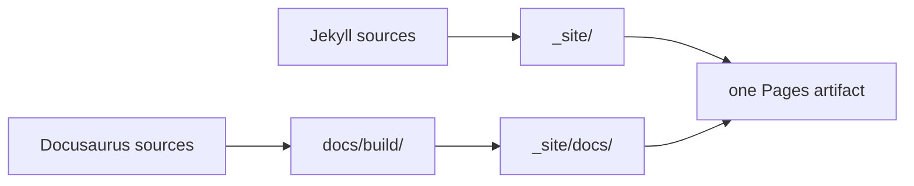

# Project structure

The repository has three concerns: agent instructions, operational references, and a two-generator public website.

```text
apkdecomp-skill/
├── SKILL.md                    # skill metadata and core workflow
├── references/                 # concise runtime reference material
├── docs/                       # Docusaurus app served under /docs
│   ├── content/                # long-form public documentation
│   ├── src/css/custom.css      # documentation theme tokens
│   ├── static/img/             # documentation marks/social card
│   ├── docusaurus.config.js    # docs routes, navbar, plugins
│   ├── sidebars.js             # curated information architecture
│   └── package.json
├── _layouts/default.html       # Jekyll HTML shell
├── assets/                     # landing-page styles, scripts, artwork
├── index.html                  # Jekyll landing page
├── 404.html                    # project-site error page
├── _config.yml                 # Jekyll config and project base URL
├── Gemfile                     # pinned Jekyll toolchain
├── scripts/build-site.sh       # merges both generated sites
└── .github/workflows/site.yml  # validation and GitHub Pages deploy
```

## Runtime skill files

### `SKILL.md`

This is the agent-facing entry point. Its YAML description controls discovery; its body defines scope, default workflow, and required reference lookups.

Keep it concise. Material needed on every activation belongs here. Specialist explanations belong in `references/`.

### `references/`

These files are optimized for agent use:

| File | Responsibility |
|---|---|
| `decompiler-selection.md` | mandatory route selection by era, framework, and protection |
| `commands.md` | short command examples and install notes |
| `deobfuscation.md` | mappings, semantic renaming, string/control-flow handling |
| `native-analysis.md` | ABI and JNI/native route |
| `dynamic-analysis.md` | authorized runtime fallback |
| `troubleshooting.md` | symptom-to-remediation table |

The public documentation under `docs/content/` expands this material for human readers. It is intentionally not loaded by the skill at runtime.

## Jekyll responsibility

Jekyll owns only the primary project pages:

- `/apkdecomp-skill/`
- `/apkdecomp-skill/404.html`
- `/apkdecomp-skill/assets/*`

`_config.yml` excludes `docs/`, `references/`, `SKILL.md`, dependency directories, and repository metadata so Jekyll does not accidentally publish or transform them.

The landing page uses no Jekyll theme gem. `_layouts/default.html` supplies metadata and shared assets; `index.html` supplies the product page.

## Docusaurus responsibility

Docusaurus is configured with:

```js
docs: {
  path: 'content',
  routeBasePath: '/',
}
```

Its **site** base URL is `/apkdecomp-skill/docs/`, while the docs plugin's route is `/` inside that site. This avoids a duplicated `/docs/docs/` route.

`DOCS_BASE_URL` overrides the site prefix for local/preview builds. The default `/docs/` supports `npm run start --prefix docs`.

The docs build includes:

- curated sidebars;
- Mermaid diagrams;
- offline/local search index generation;
- edit links to the repository;
- dark/light color modes;
- sitemap and per-page metadata.

## Combined build contract

`scripts/build-site.sh` does the following:



The `SITE_BASEURL` environment variable controls project-path links. Locally it is empty, so the output is served at `/` with docs at `/docs/`. In GitHub Actions it is `/<repository-name>`, so public links resolve under the GitHub Pages project path. The Pages artifact itself stays flat: GitHub maps the artifact root to that project URL.

## Source-of-truth boundaries

- Update the skill behavior in `SKILL.md` and `references/` first.
- Update human tutorials in `docs/content/` when behavior or commands change.
- Do not copy generated `_site/` or `docs/build/` artifacts into Git.
- Keep `package-lock.json` and `Gemfile.lock` committed so CI uses reviewed dependency resolutions.
- Keep deployment path logic in the build script and Docusaurus config, not hardcoded throughout content.

See [Website development](../contributing/website.md) for local commands and deployment checks.
